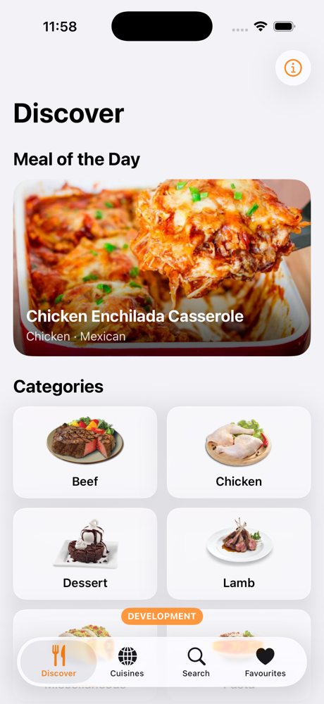
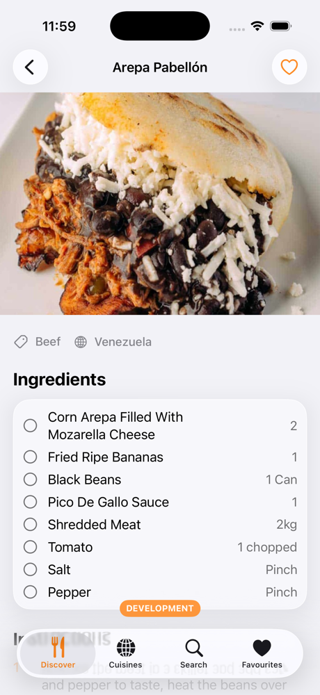
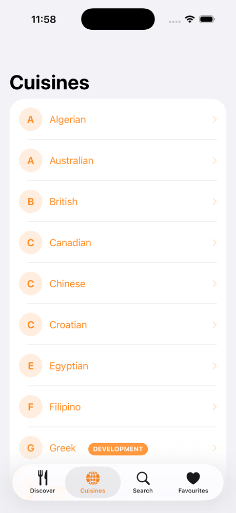
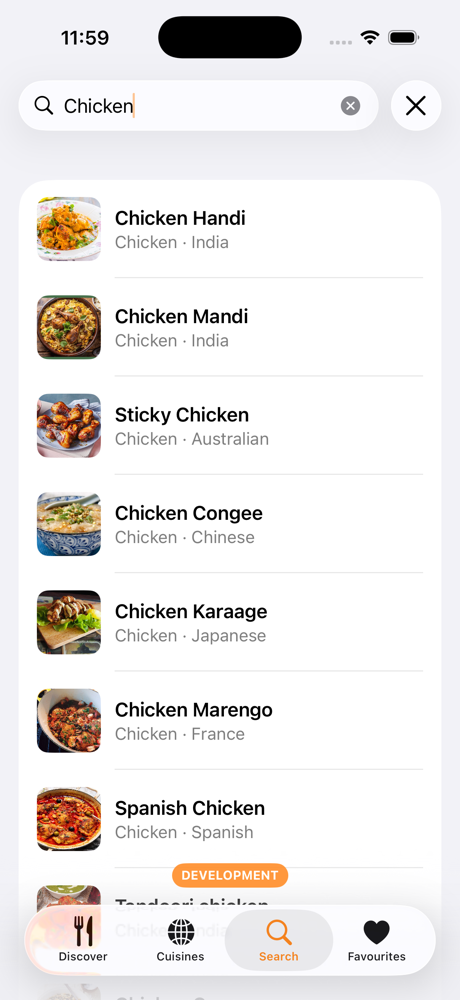
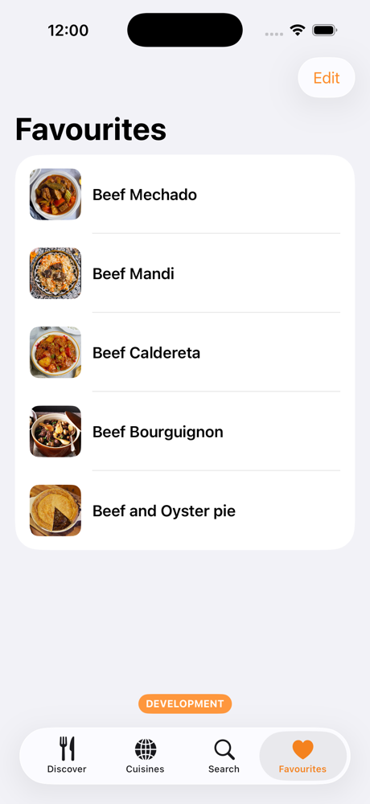

# Recipe Box

A SwiftUI recipe browser powered by **[TheMealDB](https://www.themealdb.com)** — and a complete, runnable reference app built with the [**iOSAppTemplate**](https://github.com/konotori/iOSAppTemplate) Clean Architecture template (scaffolded via `make new-app`).

   

<p align="center">
  
  
  
  
  
</p>
<p align="center"><sub><b>Discover</b> · <b>Meal detail</b> · <b>Cuisines</b> · <b>Search</b> · <b>Favourites</b></sub></p>

## Features

- **Discover** — a random "Meal of the Day" plus the full category grid.
- **Cuisines** — browse by cuisine (curated to the areas that actually have recipes), drill into the meals.
- **Search** — debounced search by name (`.searchable` + `.task(id:)`).
- **Meal detail** — hero image (tap to zoom full-screen), an interactive ingredient checklist, numbered instructions, YouTube / source links, and a favourite toggle with haptics.
- **Favourites** — saved locally with **SwiftData**, reactive list, swipe to remove.
- **English + Vietnamese** via a String Catalog.

## What it demonstrates

- **Clean Architecture** with a strict one-way dependency rule —
  `Presentation → Domain ← Data`, shared helpers in `Foundation`, wired in `App/AppContainer`:
  - **Domain** — `Meal`/`MealCategory`/`Area` models, repository protocols, 8 use cases (no framework imports).
  - **Data** — TheMealDB DTOs, RESTKit endpoints, mappers, a repository that maps `APIError` → domain `MealError`, and a SwiftData-backed `FavoritesStore`.
  - **Presentation** — SwiftUI screens with `@Observable` view models, a `Loadable` state enum, design tokens, and a Liquid-Glass card modifier.
- **Bundled packages**: [RESTKit](https://github.com/konotori/RESTKit) (compile-time-typed networking), [NaviStack](https://github.com/konotori/NaviStack) (per-tab type-safe router + an analytics interceptor), [LogPipe](https://github.com/konotori/LogPipe) (structured logging).
- **Modern Apple APIs**: SwiftData, the Observation framework, `NavigationStack`, the iOS 18 `Tab` API, `.sensoryFeedback`, `ContentUnavailableView`, `MagnifyGesture`, and **Liquid Glass** (iOS 26) with a material fallback gated by `#available`.
- **Multi-environment** (Dev / Staging / Prod) selected at compile time via `SWIFT_ACTIVE_COMPILATION_CONDITIONS` → `AppEnvironment`.
- **33 Swift Testing** unit tests (mappers, use cases, repository error/`null` handling, favourites, environment, extensions).

## Requirements

- **Xcode 26+** (the app conditionally adopts the iOS 26 Liquid Glass APIs, so it needs the iOS 26 SDK to compile).
- Deployment target **iOS 18**.

## Getting started

```bash
bash scripts/bootstrap.sh      # Mint + pinned SwiftLint/SwiftFormat + pre-commit
open RecipeBox.xcodeproj
```

Pick a scheme — **RecipeBox-Dev** / **-Staging** / **-Prod** — and run. Dev/Staging show an environment badge and verbose logging; Prod is clean. TheMealDB's public test API key (`1`) is used, so there's nothing to configure.

## Day-to-day

| When | Command |
|---|---|
| Before committing | `make fix` (format + auto-fix lint) |
| Full gate (what CI runs) | `make verify` |
| Tests | `xcodebuild test -scheme RecipeBox-Dev …` |

CI: `.github/workflows/ci.yml` runs lint + test + a duplicate-image gate (on PRs it flags duplicates the PR introduces; on push to `main`, any duplicate), and `hygiene.yml` runs a weekly unused-image scan — what each image check covers is in [docs/IMAGE_HYGIENE.md](docs/IMAGE_HYGIENE.md). (A renamable `ci.yml.example` starter also ships for fresh clones.)

## Architecture & conventions

The `docs/` folder (inherited from the template) documents the architecture, folder layout, conventions, and tooling in depth — start with [docs/ARCHITECTURE.md](docs/ARCHITECTURE.md) and [docs/TOOLING.md](docs/TOOLING.md); the image checks are covered in [docs/IMAGE_HYGIENE.md](docs/IMAGE_HYGIENE.md).

## Credits

Recipe data from [TheMealDB](https://www.themealdb.com). Scaffolded from [iOSAppTemplate](https://github.com/konotori/iOSAppTemplate). MIT licensed.
